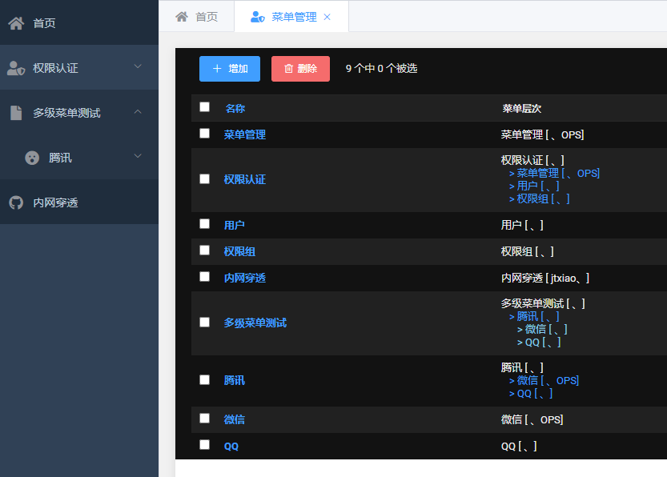
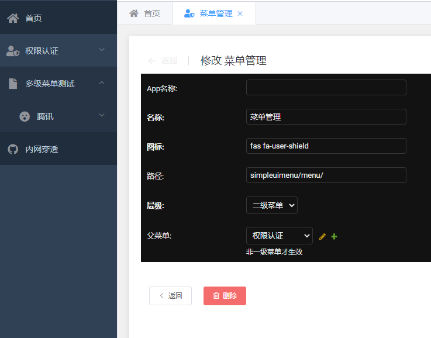
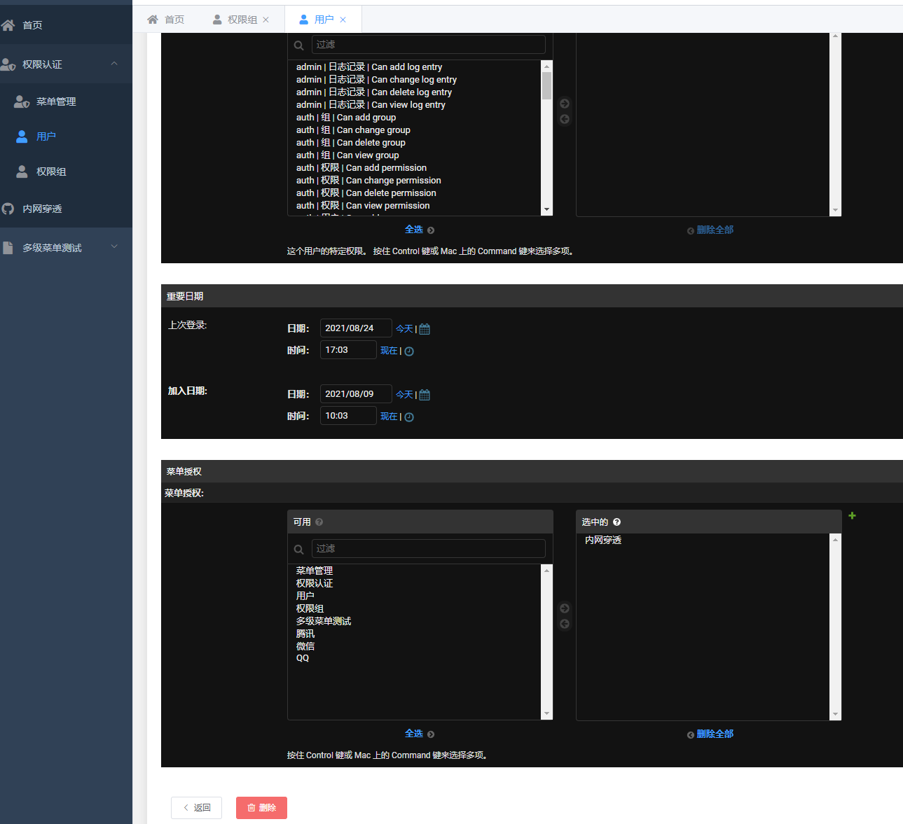
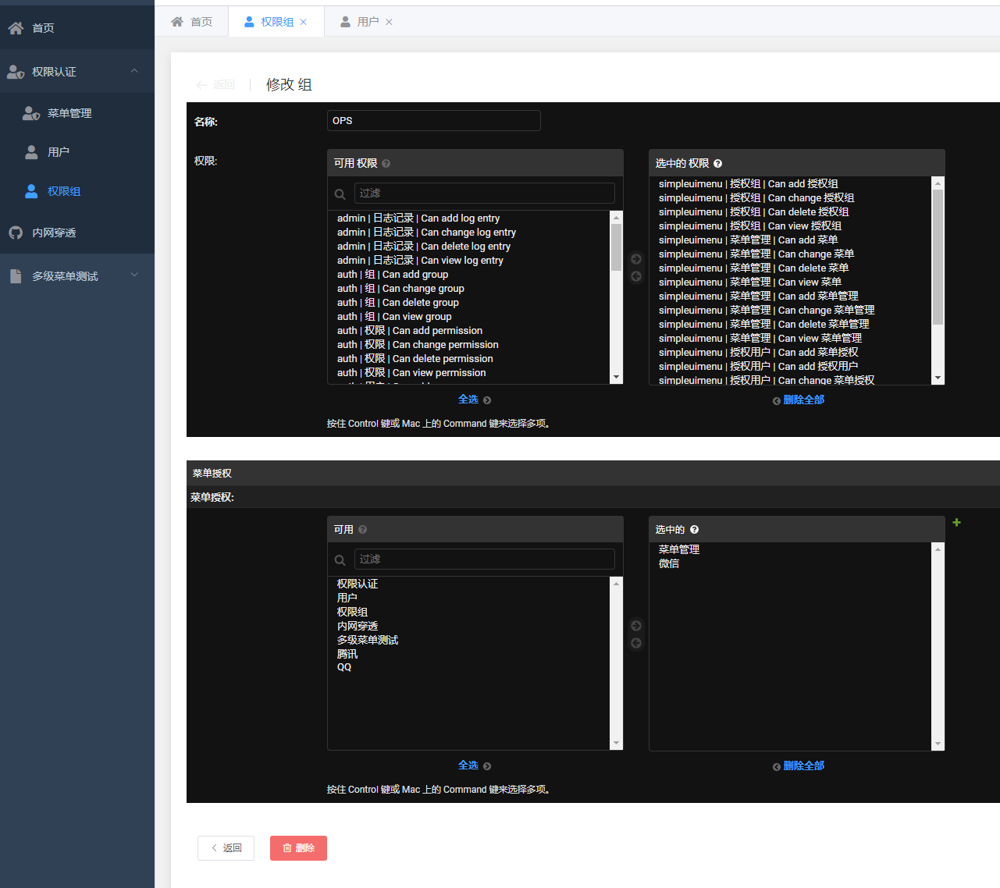

基于django Simpleui的菜单权限控制模块
====

## 说明
simpleUI是一个基于django的漂亮主题，上手简单。但是她的自定义菜单不能通过django自带权限系统进行权限控制详见：https://simpleui.72wo.com/docs/simpleui/QUICK.html#%E4%BE%8B%E5%AD%90

所以经过几次对django权限控制模块的页面重写和琢磨之后完成本模块

界面呈现上做到与django-admin兼容（其实是重写它太费劲）

## 效果图
1. 
1. 
1. 
1. 

## 使用步骤
1. 创建虚拟环境
2. 使用pip安装本模块
3. 配置settings
4. 运行migrate命令，创建数据库和表
5. 通过django-admin管理后台添加菜单信息和新增用户并赋予模块和菜单权限
6. 运行 python manange.py runserver 启动服务器进行效果预览

## settings设置
*必须引入simpleui主题*
```
INSTALLED_APPS = [
	'simpleui',
	'simpleuimenu',
	...
]
```
具体设置参考simpleui官方的设置，唯一区别在于`SIMPLIEUI_CONFIG`变量。配置样例：
```
# 定制侧边栏
# 由于菜单具体信息交给simpleuimenu管理，只保留如下信息
SIMPLEUI_CONFIG = {
    'system_keep': False,  # 关闭系统菜单
    'dynamic': True,  # 设置是否开启动态菜单, 默认为False. 如果开启, 则会在每次用户登陆时动态展示菜单内容
}
```
# *重要提示*

配置`SIMPLEUI_CONFIG`的时候必须要如下做，否在动态菜单将不生效

1. 主settings文件末尾加入如下代码
```
# simpleUi settings 将simpleUI 的设置独立出来
try:
    from .simpleui_settings import *
except ImportError:
    pass
```
2. 项目根目录新增扩展配置文件`simpleui_settings.py`,将simpleui的配置信息单独配置
```
SIMPLEUI_CONFIG = {
    'system_keep': False,  # 关闭系统菜单
    'dynamic': True,  # 设置是否开启动态菜单, 默认为False. 如果开启, 则会在每次用户登陆时动态展示菜单内容
}
```

## 启动项目
1. 迁移数据
```
python manage.py migrate
```
2. 启动开发服务器进行设置
```
python manage.py runserver
```
3. 创建超级用户
```
python manage.py createsuperuser
```
4. 进入web管理界面添加菜单信息

5. 启用中间件
```
MIDDLEWARE = [
		...
	'simpleuimenu.middlewares.AuthMenu',
]
```

6. 初始化数据（可选）
使用哪种类型数据库完全取决于你自己，本模块开发采用默认的sqlite3
你可以在migrate完成之后通过数据库客户端工具执行一下脚本，以期快速完成测试数据的添加
```
INSERT INTO simplemenu (id, app, name, icon, url, level, parent_id) VALUES (1, null, '菜单管理', 'fas fa-user-shield', 'simpleuimenu/menu/', 2, 2);
INSERT INTO simplemenu (id, app, name, icon, url, level, parent_id) VALUES (2, null, '权限认证', 'fas fa-user-shield', null, 1, null);
INSERT INTO simplemenu (id, app, name, icon, url, level, parent_id) VALUES (3, null, '用户', 'fa fa-user', 'auth/user/', 2, 4);
INSERT INTO simplemenu (id, app, name, icon, url, level, parent_id) VALUES (4, null, '权限组', 'fa fa-user', 'auth/group/', 2, 4);
INSERT INTO simplemenu (id, app, name, icon, url, level, parent_id) VALUES (5, null, '内网穿透', 'fab fa-github', 'https://www.wezoz.com', 1, null);
INSERT INTO simplemenu (id, app, name, icon, url, level, parent_id) VALUES (6, 'simpleuimenu', '多级菜单测试', 'fas fa-file', null, 1, null);
INSERT INTO simplemenu (id, app, name, icon, url, level, parent_id) VALUES (7, null, '腾讯', 'fas fa-surprise', null, 2, 6);
INSERT INTO simplemenu (id, app, name, icon, url, level, parent_id) VALUES (8, null, '微信', 'fas fa-user-shield', 'https://mp.weixin.qq.com', 3, 7);
INSERT INTO simplemenu (id, app, name, icon, url, level, parent_id) VALUES (9, null, 'QQ', 'fas fa-user-shield', 'https://www.qq.com', 3, 7);
```

## 打包
```
python setup.py sdist
```
打包详情自行Google

## 安装
将打包生成物，通常位于`sdist`目录下，例如：
```
pip install django-simpleui-menu-1.0.tar.gz
```

## 完善代码
1. 克隆项目到本地
2. 自己项目中引入本项目即可

## 后记
欢迎切磋交流 QQ:343742249
